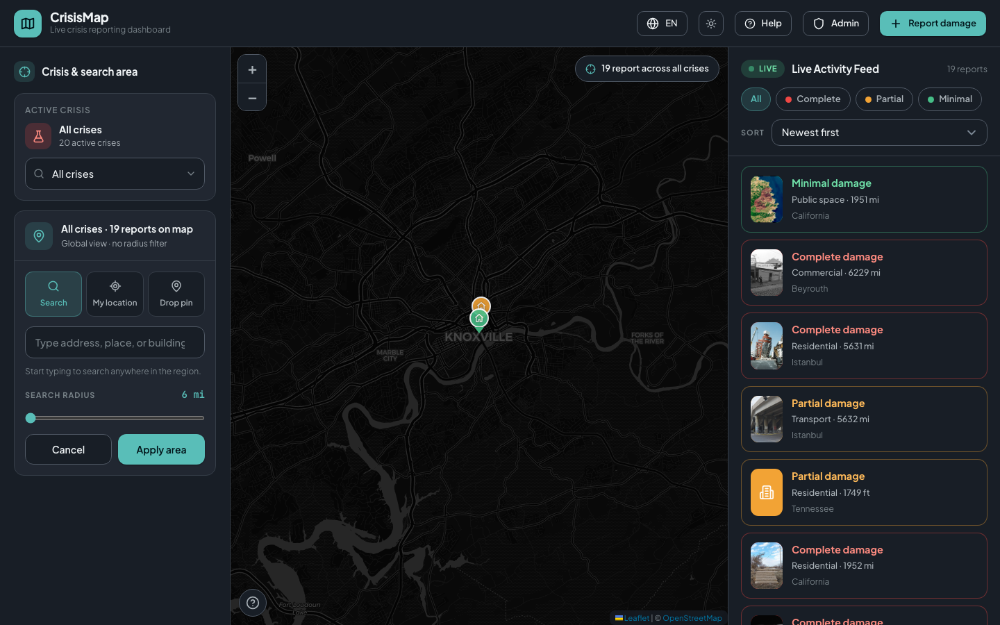
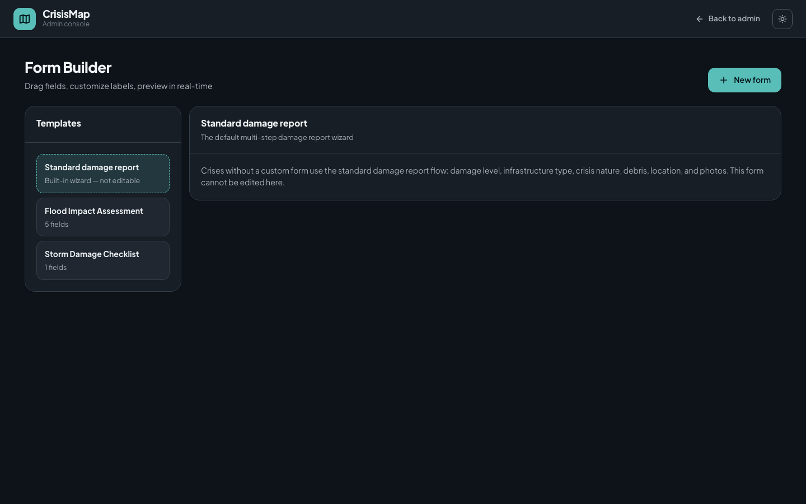
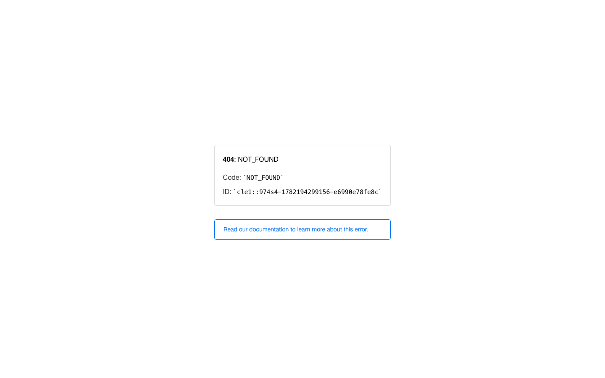
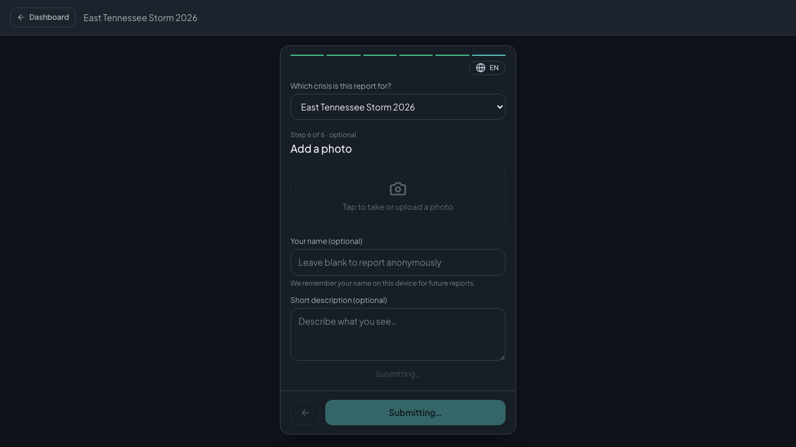
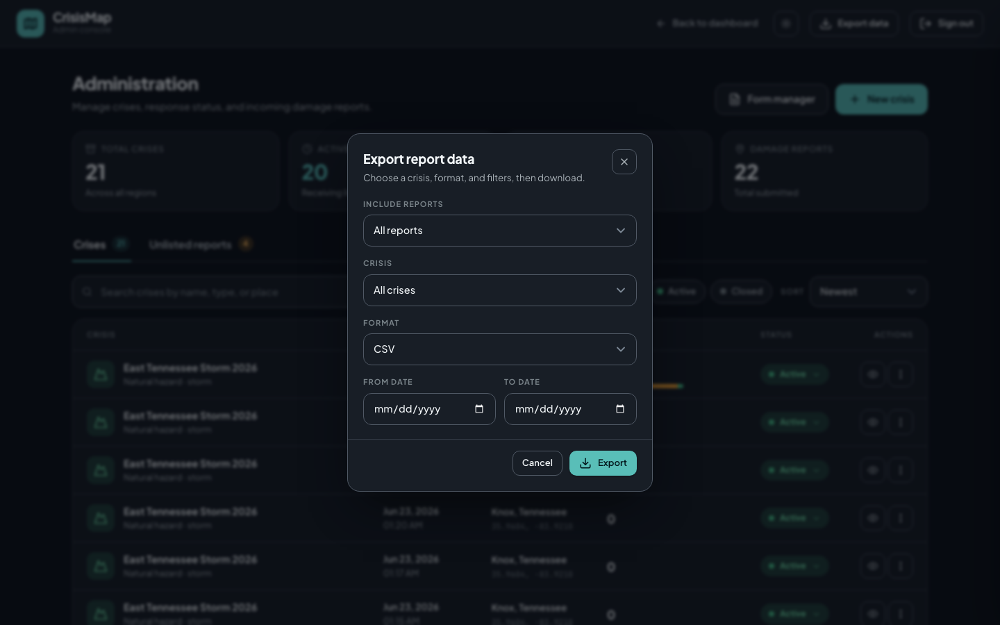

# CrisisMap — Design Document & Evaluator Guide

**Version:** MVP (June 2026)  
**Prepared for:** UNDP / humanitarian evaluators  
**Live prototype:** [https://crisis-map-phi.vercel.app/](https://crisis-map-phi.vercel.app/)

---

## Executive Summary

CrisisMap is a web-based damage assessment platform for humanitarian crisis response. Field teams capture structured damage reports—severity, building type, location, and photos—**without creating accounts**. Coordinators use a password-protected admin panel to open crises, triage incoming reports, customize data collection forms, and export data for GIS and coordination workflows.

The MVP is designed for **real emergency settings**: intermittent connectivity, multilingual field teams, rapidly evolving situations, and the need to share validated data with partners (UNDP, UN OCHA, national disaster agencies, NGOs).

---

## Table of Contents

1. [How to Access the Prototype](#1-how-to-access-the-prototype)
2. [Who Uses CrisisMap](#2-who-uses-crisismap)
3. [Feature Overview](#3-feature-overview)
4. [Step-by-Step: Field User Workflow](#4-step-by-step-field-user-workflow)
5. [Step-by-Step: Admin Workflow](#5-step-by-step-admin-workflow)
6. [Real-World Scenarios](#6-real-world-scenarios)
7. [Security](#7-security)
8. [Scalability & Performance](#8-scalability--performance)
9. [Architecture Overview](#9-architecture-overview)
10. [Evaluator Checklist](#10-evaluator-checklist)

---

## 1. How to Access the Prototype

### Web version (recommended — no install)

| Resource | URL / path |
|----------|------------|
| **Live dashboard** | [https://crisis-map-phi.vercel.app/](https://crisis-map-phi.vercel.app/) |
| **Submit a report** | [https://crisis-map-phi.vercel.app/report](https://crisis-map-phi.vercel.app/report) |
| **Admin panel** | [https://crisis-map-phi.vercel.app/admin](https://crisis-map-phi.vercel.app/admin) |
| **Map legend / help** | [https://crisis-map-phi.vercel.app/help](https://crisis-map-phi.vercel.app/help) |

> **Admin access:** Contact the project team for the evaluator admin password. Admin credentials are not published in this document.

### Demo video (2-minute walkthrough)

A narrated screen recording covers the full product flow—admin login, crisis creation, field reporting, dashboard, version history, unlisted triage, form builder, export, and offline sync:

- **File:** `demo/output/crisismap-full-demo.mp4` (in this repository)
- **WebM (with audio):** `demo/output/crisismap-full-demo-with-audio.webm`

### Run locally (for UNDP technical evaluators)

```bash
# 1. Backend
cd backend
cp .env.example .env   # set SUPABASE_URL, SUPABASE_SERVICE_ROLE_KEY, ADMIN_PASSWORD
python -m venv .venv && source .venv/bin/activate
pip install -r requirements.txt
# Apply SQL migrations in backend/migrations/ via Supabase SQL Editor
uvicorn app.main:app --reload --port 8000

# 2. Frontend (second terminal)
cd frontend
npm install && npm run dev
# Open http://localhost:5173
```

- **API documentation (interactive):** [http://localhost:8000/docs](http://localhost:8000/docs)
- **Seed demo data:** `python backend/scripts/seed_demo_data.py` (6 crises, ~27 reports, photos, version stacks)
- **Volume testing:** `python backend/scripts/seed_test_reports.py --count 500 --validate`

### Screenshots in this document

All screenshots are stored in `docs/screenshots/` and referenced below. Public views were captured from the live deployment; admin views were captured from a local instance with seeded demo data.

---

## 2. Who Uses CrisisMap

| Role | Access | Primary goals |
|------|--------|---------------|
| **Field reporter** | Public — no account | Document damage at a site; works on phone or laptop |
| **Crisis coordinator / admin** | Password-protected `/admin` | Open crises, triage reports, export data, manage forms |
| **Analyst / partner agency** | Export files (CSV, GeoJSON, Shapefile) | Import into Excel, QGIS, ArcGIS, or coordination dashboards |

---

## 3. Feature Overview

### 3.1 Public / Field Features

| Feature | What it does | Why it matters in the field |
|---------|--------------|------------------------------|
| **Live crisis map** | Color-coded pins by damage severity on an interactive map | Coordinators see situational awareness in real time without waiting for paper forms |
| **Damage reporting wizard** | Guided steps: severity → building type → crisis type → debris → location → photos | Ensures consistent, comparable data even when reporters are volunteers |
| **No account required** | Anonymous submission (optional reporter name) | Removes signup friction during emergencies when every minute counts |
| **GPS / map tap / place search** | Multiple ways to set location | Works whether the reporter has GPS, is indoors, or only knows an address |
| **Building footprint picker** | OSM building polygons at high zoom | Pins damage to the correct structure, not just a street corner |
| **Photo capture** | Up to 5 images per report (JPEG/PNG/WebP) | Visual evidence for validation and donor reporting |
| **Version history** | Repeat assessments at the same building stack as versions | Tracks how damage evolves over days (e.g., flood receding, aftershocks) |
| **“Other (not listed)” reporting** | Reports to a hidden queue when the event isn’t in the crisis list | Field teams aren’t blocked when a new event appears before admins create it |
| **Offline mode** | Reports queue on device; sync when connectivity returns | Critical in disaster zones with unreliable mobile networks |
| **6 languages** | English (full), Arabic (RTL), Chinese, French, Russian, Spanish | Serves multinational response teams and affected communities |
| **Mobile layout** | Bottom navigation, touch-friendly controls | Designed for phones—the device most field teams actually carry |
| **Live activity feed** | Recent reports stream beside the map | Coordinators spot new submissions without refreshing |


*Figure 1 — Operations dashboard with crisis selector, map pins, search rail, and live activity feed.*

### 3.2 Admin Features

| Feature | What it does | Why it matters for coordinators |
|---------|--------------|--------------------------------|
| **Secure admin login** | HMAC-signed session token (24 h); stored in browser session only | Protects crisis management and export from unauthorized access |
| **Crisis management** | Create, edit, close, and reopen crises with epicenter and type | Admins define what field teams see and report against |
| **Dashboard KPIs** | Total/active/closed crises, report counts, severity breakdown | One-screen operational picture for briefing calls |
| **Unlisted report queue** | Review, assign, create crisis from, or dismiss orphan reports | Nothing is lost when reporters encounter an unlisted event |
| **Form builder** | Drag-and-drop custom forms (text, select, radio, checkbox, date, file) | Tailor data collection per crisis—flood depth vs. wildfire evacuation |
| **Data export** | CSV, GeoJSON, and Shapefile (ZIP) with date/status filters | Feeds UNDP, OCHA, and national GIS pipelines directly |
| **Report deletion** | Permanently remove reports and associated photos | Supports GDPR-style corrections and bad-data cleanup |


*Figure 2 — Admin authentication gate.*


*Figure 3 — Admin dashboard with crisis KPIs and management table.*


*Figure 4 — Custom form template manager for crisis-specific data collection.*

---

## 4. Step-by-Step: Field User Workflow

### Scenario A — Report damage during an active crisis

| Step | Action | Screen |
|------|--------|--------|
| 1 | Open [crisis-map-phi.vercel.app/report](https://crisis-map-phi.vercel.app/report) on phone or laptop | Report wizard loads active crises |
| 2 | Select the active crisis (e.g., “Istanbul Earthquake 2026”) | Crisis context is attached to the report |
| 3 | Choose **damage level**: Minimal / Partial / Complete | Standardized severity for map coloring and analytics |
| 4 | Choose **infrastructure type**: Residential, Commercial, Government, etc. | Enables sector-specific resource allocation |
| 5 | Confirm **nature of crisis** (earthquake, flood, wildfire, …) | Aligns with UNDRR hazard taxonomy |
| 6 | Indicate **debris present** (yes/no) | Flags clearance and access priorities |
| 7 | Set **location** via GPS, map tap, place search, or building pick | Georeferenced for map display and export |
| 8 | Add **photos** (optional, up to 5) | Evidence for validation teams |
| 9 | Submit | Report appears on dashboard after validation |


*Figure 5 — Multi-step damage reporting wizard (no account required).*

### Scenario B — View situational awareness on the dashboard

| Step | Action |
|------|--------|
| 1 | Open [crisis-map-phi.vercel.app](https://crisis-map-phi.vercel.app/) |
| 2 | Select a crisis from the dropdown or let GPS suggest the nearest |
| 3 | Use the search rail to filter by radius, damage level, or sort order |
| 4 | Click a map pin to open report detail, photos, and version history |
| 5 | Tap “Report damage here” to start a new report at that location |


*Figure 6 — Map legend explaining pin colors (severity) and icons (cause / building type).*

### Scenario C — Report when offline

| Step | Action |
|------|--------|
| 1 | Complete the report wizard while connectivity is unavailable |
| 2 | App saves the report and photos to device storage (IndexedDB) |
| 3 | A banner shows pending reports waiting to sync |
| 4 | When the network returns, reports upload automatically (background sync) |


*Figure 7 — Offline queue banner: reports are stored locally and sync when connectivity returns.*

---

## 5. Step-by-Step: Admin Workflow

### 5.1 Initial setup — Open a new crisis

| Step | Action |
|------|--------|
| 1 | Go to `/admin` and sign in with the admin password |
| 2 | Click **New crisis** |
| 3 | Enter name, crisis type/subtype, and onset date |
| 4 | Set epicenter via place search (e.g., “Knoxville, Tennessee”) |
| 5 | Optionally assign a **custom form template** |
| 6 | Save — crisis appears as **Active** on the public dashboard |

**Real-world value:** Within minutes of an event, coordinators define what field teams report against—before paper forms are printed or WhatsApp groups fragment.

### 5.2 Daily operations — Monitor and triage

| Step | Action |
|------|--------|
| 1 | Review dashboard KPIs (report counts, severity mix) |
| 2 | Open the public map to verify pin distribution |
| 3 | Check the **Unlisted reports** tab for orphan submissions |
| 4 | Assign unlisted reports to an existing crisis, or **create a new crisis** from a report |
| 5 | Close crises when the response phase ends (data remains exportable) |

### 5.3 Customize data collection

| Step | Action |
|------|--------|
| 1 | Go to `/admin/forms` |
| 2 | Create a template (e.g., “Flood Impact Assessment” with water depth, evacuation status) |
| 3 | Assign the template when creating or editing a crisis |
| 4 | Field users see the custom form instead of the default wizard |

**Example:** Jakarta Floods demo crisis uses a custom flood form with water depth and evacuation fields—data that standard damage forms don’t capture.

### 5.4 Export for partners

| Step | Action |
|------|--------|
| 1 | From the admin dashboard, click **Export** |
| 2 | Choose format: **CSV** (Excel), **GeoJSON** (web maps), or **Shapefile** (QGIS/ArcGIS) |
| 3 | Filter by crisis, date range, and report status |
| 4 | Download and share with UNDP, cluster leads, or national GIS teams |

**Export columns include:** report ID, damage level, infrastructure type, coordinates, what3words, admin boundaries, photo URLs, submission channel (mobile/web), timestamps, and custom form responses.


*Figure 8 — Data export dialog: CSV, GeoJSON, or Shapefile with crisis, date, and status filters.*

---

## 6. Real-World Scenarios

### Scenario 1 — Earthquake rapid damage assessment

**Context:** A 6.8 magnitude earthquake strikes Istanbul. UNDP partners need georeferenced building damage within 48 hours.

| Actor | CrisisMap action | Outcome |
|-------|------------------|---------|
| Admin | Creates “Istanbul Earthquake 2026” crisis with epicenter | Field teams see the crisis immediately |
| Field volunteers | Submit 200+ reports with photos via phones | Structured data replaces ad-hoc social media posts |
| Coordinator | Views color-coded map; filters by “Complete” damage | Prioritizes search-and-rescue and structural assessment |
| Analyst | Exports GeoJSON to QGIS | Overlays damage on building footprints for cluster briefings |
| Return visit (Day 3) | New report at same building → **version 3** | Tracks aftershock damage progression |

**Demo data:** `seed_demo_data.py` includes Istanbul Earthquake with a 3-version history stack at Karaköy.

---

### Scenario 2 — Flood with custom assessment form

**Context:** Monsoon flooding in Jakarta. Coordinators need water depth and evacuation status—not just “partial damage.”

| Actor | CrisisMap action | Outcome |
|-------|------------------|---------|
| Admin | Builds “Flood Impact Assessment” form in form builder | Captures depth, evacuation, access notes, pump needs |
| Admin | Assigns form to “Jakarta Floods 2026” crisis | Field teams see flood-specific questions |
| Community volunteers | Submit reports with standing-water photos | Evidence-backed flood extent mapping |
| Cluster lead | Exports CSV filtered by date range | Feeds WASH and shelter cluster sitreps |

---

### Scenario 3 — Unknown / emerging event (“Other not listed”)

**Context:** A chemical spill occurs before admins have created a crisis. Field teams must not be blocked.

| Actor | CrisisMap action | Outcome |
|-------|------------------|---------|
| Field reporter | Selects **“Other (not listed)”** in the wizard | Report saved to hidden unlisted queue |
| Admin | Opens **Unlisted reports** tab | Reviews submission with location and photos |
| Admin | **Creates new crisis** from the report (epicenter = report coords) | New crisis live in one click |
| Public | Unlisted reports never appear on the public map until assigned | Prevents misinformation on the operations map |

---

### Scenario 4 — Remote area with no connectivity

**Context:** Assessment teams operate in a valley with no mobile signal after a wildfire.

| Actor | CrisisMap action | Outcome |
|-------|------------------|---------|
| Field team | Completes reports offline; photos stored on device | No data loss |
| Team returns to base camp | Device reconnects; **offline sync banner** clears | All queued reports upload automatically |
| Coordinator | Map updates with new pins | Situational picture catches up without manual re-entry |

---

### Scenario 5 — Multi-agency data handoff

**Context:** National disaster agency, UNDP, and an NGO all need the same dataset in different tools.

| Format | Consumer | Use |
|--------|----------|-----|
| **CSV** | Excel / Power BI | Sitreps, donor dashboards, statistical summaries |
| **GeoJSON** | Web maps, Carto, Kepler.gl | Rapid visualization and sharing |
| **Shapefile** | QGIS, ArcGIS | Integration with existing government GIS layers |

All three formats are generated from the same validated report database—single source of truth.

---

### Scenario 6 — Closed crisis / after-action review

**Context:** East Tennessee flood response ends; data needed for recovery planning.

| Actor | CrisisMap action | Outcome |
|-------|------------------|---------|
| Admin | Marks crisis as **Closed** | Removed from active public list; data preserved |
| Analyst | Exports all reports (active + closed filter) | After-action review and recovery funding evidence |

---

## 7. Security

### 7.1 Security model

| Layer | Implementation | Field relevance |
|-------|----------------|-----------------|
| **Public reporting** | No authentication; optional reporter name (defaults to anonymous) | Zero friction for volunteers; no PII required |
| **Admin access** | Shared password → HMAC-SHA256 signed token; `secrets.compare_digest` on login | Only coordinators manage crises and export |
| **Token storage** | `sessionStorage` (cleared when browser tab closes) | Admin sessions don’t persist across devices |
| **Database access** | Service role key server-side only; never exposed to frontend | Frontend cannot directly query or modify the database |
| **Photo storage** | Supabase Storage with signed URLs (1 h read, 5 min upload) | Photos aren’t publicly listable; access is time-limited |
| **Unlisted isolation** | Unlisted crisis hidden from all public map/list APIs | Orphan reports can’t pollute the operations picture |
| **Transport** | HTTPS (Vercel + Supabase TLS) | Data encrypted in transit |
| **Request tracing** | `X-Request-ID` on every API call | Audit trail for incident investigation |
| **CORS** | Configurable allowed origins | Prevents unauthorized cross-origin API abuse |

### 7.2 Known MVP limitations (transparent for evaluators)

| Gap | Mitigation path |
|-----|-----------------|
| Single shared admin password (no per-user accounts) | Production: individual accounts + MFA |
| No Row-Level Security (RLS) yet | Production: Supabase JWT + RLS policies |
| Open report creation API | Production: rate limiting, CAPTCHA, or invite tokens |
| No app-layer encryption at rest | Relies on Supabase platform encryption |

### 7.3 Data privacy considerations

- Reporters are anonymous by default.
- Photos are stored in a private bucket with signed URL access.
- Admins can permanently delete reports (supports correction requests).
- Export is admin-gated for bulk/shapefile downloads; per-crisis CSV/GeoJSON is available for validated data sharing.

---

## 8. Scalability & Performance

### 8.1 Design for hundreds to thousands of reports

CrisisMap is built on **PostgreSQL + PostGIS** (via Supabase) with optimizations specifically for high report volumes:

#### Database indexes (migration `004_performance.sql`)

| Index | Purpose |
|-------|---------|
| `idx_report_crisis_latest` | Fast map pin queries (latest version only) |
| `idx_report_crisis_status_latest` | Filter by validation status |
| `idx_report_crisis_damage_latest` | Filter by severity on map |
| `idx_location_geog` (GIST) | PostGIS nearest-neighbor for 5 m location dedup |
| `idx_photo_report_uploaded` | Thumbnail lookup without N+1 queries |
| `idx_crisis_active_public` | Fast active crisis list |

#### Stored procedures (single round-trip instead of N+1)

| RPC | Replaces |
|-----|----------|
| `get_crisis_map_pins` | Per-pin photo lookups (largest performance win) |
| `get_reporting_options_data` | Multiple crisis queries on wizard load |
| `find_location_within_meters` | PostGIS location dedup on report create |
| `get_photo_counts` | Per-report photo counts in export |
| `get_report_with_photos` | Report detail panel data |
| `get_admin_dashboard_data` | Admin KPI aggregation |

#### Application-level scale features

| Feature | Detail |
|---------|--------|
| **Location versioning** | Multiple reports at the same building share one `location_id`; only latest version shows on map |
| **Paginated lists** | `GET /crises/{id}/reports?page=1&limit=200` |
| **Geohash clustering** | `GET /crises/{id}/map/clusters` for dense pin areas |
| **Export batching** | Up to 10,000 reports per export query |
| **Async API** | FastAPI + httpx async Supabase client (non-blocking) |
| **GZip compression** | Responses > 1 KB compressed |
| **Volume seed script** | `seed_test_reports.py --count 1000 --validate` for load testing |

### 8.2 Benchmark evidence

API latency was measured with `backend/scripts/benchmark_api.py` (20 runs per endpoint, local dev against Supabase):

| Endpoint | p50 latency | p95 latency | Notes |
|----------|-------------|-------------|-------|
| `GET /health` | 1.1 ms | 1.7 ms | API liveness |
| `GET /ready` | 196 ms | 221 ms | Includes Supabase connectivity check |
| `GET /crises/reporting-options` | 414 ms | 479 ms | Wizard load (single RPC) |
| `GET /crises/{id}/map` | 1,052 ms | 1,212 ms | All map pins + thumbnails (1 RPC) |
| `GET /crises/{id}/reports?limit=50` | 655 ms | 865 ms | Paginated list |
| `GET /reports/{id}` | 636 ms | 826 ms | Report detail + photos |
| `GET /reports/{id}/versions` | 425 ms | 461 ms | Version history |

> **Note:** Latency includes network round-trip to Supabase cloud. With stored procedures and partial indexes applied, map load is a **single database call** regardless of pin count (vs. N+1 without optimization). Re-benchmark after seeding 100–1,000+ reports using `seed_test_reports.py` for volume-specific numbers.

**Raw benchmark files:** `backend/scripts/benchmark_results/2026-06-21T22-30-00Z.json`

### 8.3 Production deployment readiness

| Capability | Status |
|------------|--------|
| Health probe (`/api/v1/health`) | ✅ |
| Readiness probe (`/api/v1/ready` — 503 if DB down) | ✅ |
| Docker multi-stage image (non-root user) | ✅ |
| Multi-worker deployment (`uvicorn --workers 4`) | ✅ Documented |
| Request ID tracing | ✅ |
| Horizontal scaling | ✅ Stateless API; database is managed Supabase |

### 8.4 How location dedup scales

When hundreds of reports arrive at the same coordinates (e.g., apartment block), PostGIS `find_location_within_meters` (5 m tolerance) groups them under one `location_id`. New submissions become **version 2, 3, …** instead of duplicate pins—keeping the map readable at scale.

---

## 9. Architecture Overview

```
┌─────────────────────────────────────────────────────────────┐
│  Field users & coordinators (browser / PWA)                 │
│  React + Vite frontend — hosted on Vercel                   │
│  • Map dashboard  • Report wizard  • Offline queue (IDB)    │
│  • Admin panel    • Form builder   • i18n (6 languages)     │
└──────────────────────────┬──────────────────────────────────┘
                           │ HTTPS /api/v1
┌──────────────────────────▼──────────────────────────────────┐
│  FastAPI backend (async)                                     │
│  • Versioned REST API  • Admin auth  • Export engine         │
│  • Geocoding proxy     • Photo signed URLs                   │
└──────────────────────────┬──────────────────────────────────┘
                           │
┌──────────────────────────▼──────────────────────────────────┐
│  Supabase (managed PostgreSQL + PostGIS + Storage)           │
│  • crisis, report, location, photo, form_template tables       │
│  • Performance RPCs + indexes (migrations 004–007)           │
│  • Private photo bucket with signed URL access                 │
└─────────────────────────────────────────────────────────────┘
```

### Data model (simplified)

```
crisis (1) ──< report (N) >── location (1)
report (1) ──< photo (N)
crisis (N) ──> form_template (0..1)

report.status: pending → validated | rejected
report.is_latest_version: only latest shown on map
crisis.is_unlisted: hidden singleton for "Other" queue
```

---

## 10. Evaluator Checklist

Use this checklist for independent MVP validation:

- [ ] **Open the live dashboard** at [crisis-map-phi.vercel.app](https://crisis-map-phi.vercel.app/) — verify map loads with demo crises
- [ ] **Submit a test report** at `/report` — walk through the wizard, add a photo
- [ ] **View the report on the map** — click the new pin, check detail panel
- [ ] **Test offline** — disable network in DevTools, submit a report, re-enable and confirm sync
- [ ] **Switch language** — verify UI changes (English ↔ Arabic RTL)
- [ ] **Admin login** at `/admin` (request password from project team)
- [ ] **Create a crisis** — set epicenter, assign a form template
- [ ] **Review unlisted queue** — submit via “Other (not listed)” and triage in admin
- [ ] **Export data** — download CSV and GeoJSON; open in Excel / QGIS
- [ ] **Watch demo video** — `demo/output/crisismap-full-demo.mp4`
- [ ] **Review API docs** — `http://localhost:8000/docs` (local) or request OpenAPI spec
- [ ] **Run volume seed** (optional) — `seed_test_reports.py --count 500` and observe map performance

---

## Appendix A — Supported Languages

| Code | Language | UI completeness |
|------|----------|-----------------|
| `en` | English | Complete |
| `ar` | Arabic (RTL) | Partial |
| `zh` | Chinese | Partial |
| `fr` | French | Partial |
| `ru` | Russian | Partial |
| `es` | Spanish | Partial |

Language auto-detection uses browser locale, GPS country, and IP geolocation.

## Appendix B — Demo Crises (seed data)

| Crisis | Type | Status | Special features |
|--------|------|--------|------------------|
| Istanbul Earthquake 2026 | Earthquake | Active | 3-version history stack |
| Jakarta Floods 2026 | Flood | Active | Custom flood form |
| LA Wildfire 2026 | Wildfire | Active | — |
| Beirut Explosion 2026 | Explosion | Active | — |
| Kyiv Conflict 2026 | Conflict | Active | — |
| East Tennessee Flood 2025 | Flood | **Closed** | After-action / export testing |

## Appendix C — File Index for Evaluators

| File | Description |
|------|-------------|
| `docs/UNDP-DESIGN-DOCUMENT.md` | This document |
| `docs/screenshots/` | UI screenshots referenced above |
| `demo/output/crisismap-full-demo.mp4` | Narrated product demo video |
| `demo/narration.json` | Demo chapter narration text |
| `backend/scripts/seed_demo_data.py` | Curated demo dataset seeder |
| `backend/scripts/seed_test_reports.py` | Volume/load test seeder |
| `backend/scripts/benchmark_api.py` | API performance benchmark tool |
| `backend/migrations/` | Database schema migrations (apply in Supabase) |
| `README.md` | Project setup instructions |

---

*CrisisMap MVP — built for humanitarian damage assessment. For questions or evaluator admin credentials, contact the project team.*
