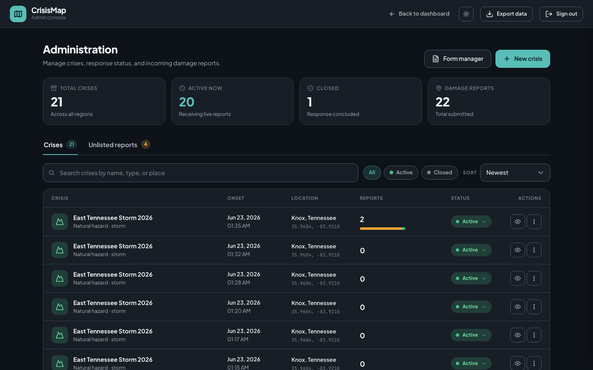
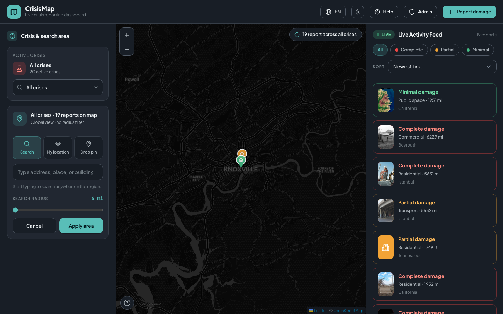

# CrisisMap — Design Document for UNDP Evaluators

**Product:** CrisisMap (humanitarian damage assessment platform)  
**Version:** MVP (Minimum Viable Product)  
**Date:** June 2026  
**Team:** UNC Pembroke — CrisisMap Project

---

## Executive Summary

CrisisMap helps humanitarian teams **capture, visualize, and export structured damage assessments** during and after crises. Field users submit reports from phones or laptops **without creating accounts**. Coordinators use an **admin console** to open crises, triage unlisted reports, customize forms, and export data for UNDP and partner analysis in **CSV, GeoJSON, or Shapefile** formats.

The platform is built for **real crisis settings**: intermittent connectivity, multilingual populations, geospatial coordination, and the need to track how damage evolves at the same building over days or weeks.

---

## Table of Contents

1. [MVP Access for Independent Evaluation](#1-mvp-access-for-independent-evaluation)
2. [Feature Overview](#2-feature-overview)
3. [Admin Guide — Step by Step](#3-admin-guide--step-by-step)
4. [Field User Guide — Step by Step](#4-field-user-guide--step-by-step)
5. [Operational Scenarios](#5-operational-scenarios)
6. [Security](#6-security)
7. [Scalability & Performance](#7-scalability--performance)
8. [Architecture](#8-architecture)
9. [Appendix](#9-appendix)

---

## 1. MVP Access for Independent Evaluation

UNDP evaluators can access CrisisMap through **three independent channels**:

### 1.1 Live Web Prototype (recommended)

| Resource | URL / path |
|----------|------------|
| **Web application** | `http://localhost:5173` when running locally (see §1.2) |
| **API documentation** | `http://localhost:8000/docs` |
| **Health check** | `http://localhost:8000/api/v1/health` |
| **Readiness probe** | `http://localhost:8000/api/v1/ready` |

> **Note:** A publicly hosted deployment URL can be added here when available (e.g. Vercel/Netlify frontend + containerized API). The repository is deployment-ready via Docker (`backend/docker-compose.yml`) and static frontend build (`npm run build`).

### 1.2 Local setup for UNDP evaluators (fully offline-capable UI)

Evaluators with the repository can run the MVP locally in ~10 minutes:

```bash
# 1. Backend
cd backend
cp .env.example .env          # Set SUPABASE_URL, SUPABASE_SERVICE_ROLE_KEY, ADMIN_PASSWORD
python -m venv .venv && source .venv/bin/activate
pip install -r requirements.txt
# Apply SQL migrations in Supabase SQL Editor (backend/migrations/*.sql)
uvicorn app.main:app --reload --port 8000

# 2. Frontend (second terminal)
cd frontend
npm install
npm run dev                   # → http://localhost:5173

# 3. Optional: seed realistic demo data
cd backend
python scripts/seed_demo_data.py --admin-password "$ADMIN_PASSWORD"
```

**Key routes after startup:**

| Page | URL |
|------|-----|
| Live crisis map | http://localhost:5173/ |
| Report damage | http://localhost:5173/report |
| Map legend / help | http://localhost:5173/help |
| Admin console | http://localhost:5173/admin |
| Form builder | http://localhost:5173/admin/forms |

**Default admin password:** value of `ADMIN_PASSWORD` in `backend/.env` (demo scripts default to `admin123` if unset).

### 1.3 Offline evaluator assets (no server required)

| Asset | Location | Description |
|-------|----------|-------------|
| **Full product walkthrough video** | `demo/output/crisismap-full-demo.mp4` | ~2-minute narrated demo of all major flows |
| **Design document + screenshots** | `docs/UNDP_DESIGN_DOCUMENT.md`, `docs/screenshots/` | This document with UI captures |
| **Source code** | Repository root | Full MVP — frontend, backend, migrations, tests |

To regenerate the demo video:

```bash
cd demo
npm install
npm run demo    # Records browser session + assembles MP4
```

### 1.4 Docker (API only)

```bash
cd backend
docker compose up --build    # API on port 8000, 4 uvicorn workers, health probes
```

Pair with a built frontend (`cd frontend && npm run build`) served by any static host, with `VITE_API_URL` pointing to the deployed API.

---

## 2. Feature Overview

### 2.1 Why each feature matters in a real crisis

| Feature | What it does | Real-world value |
|---------|--------------|------------------|
| **Anonymous field reporting** | No login required to submit damage | Lowers barrier for affected communities and volunteers; works when identity systems are down |
| **Structured damage taxonomy** | Minimal / partial / complete + infrastructure type | Enables comparable statistics across regions for UNDP needs assessments |
| **GPS + address + what3words location** | Multiple ways to pin a building | Works when street signs are gone, addresses unknown, or GPS is the only signal |
| **Photo attachments** | Upload evidence with each report | Supports verification, media briefings, and post-crisis documentation |
| **Live crisis map** | Severity-colored pins, filters, activity feed | Gives coordinators **situational awareness** in the first hours of response |
| **Version history** | Re-assessments at the same building stack as v1, v2, v3… | Tracks **damage progression** after aftershocks, floods, or delayed access |
| **Unlisted report queue** | “Other” crisis option when no event is declared yet | Captures early intelligence before an official crisis is opened |
| **Custom form builder** | Admins design per-crisis questionnaires | Adapts to cyclone vs. chemical spill vs. conflict without code changes |
| **Multi-format export** | CSV, GeoJSON, Shapefile (admin) | Feeds GIS desks, Excel analysis, and partner systems (UN OCHA, national NDMOs) |
| **Offline / PWA sync** | Queue reports locally, sync when online | Essential where towers and fiber are damaged |
| **Multilingual UI** | EN, AR, ES, FR, RU, ZH + geo-based detection | Serves diverse affected populations and international responders |
| **Admin crisis lifecycle** | Active ↔ closed crises | Prevents stale events from cluttering field forms after response ends |
| **Building footprints** | OSM polygons at high zoom | Helps users tap the correct structure in dense urban areas |
| **Submission channel tracking** | `mobile` vs `web` | Informs deployment strategy (SMS/USSD vs. web campaigns) |

### 2.2 Role summary

| Role | Authentication | Primary tasks |
|------|----------------|---------------|
| **Field user / public** | None | Submit reports, view public map, use offline queue |
| **Coordinator / admin** | Shared password → session token | Manage crises, triage unlisted reports, build forms, export data, delete reports |

---

## 3. Admin Guide — Step by Step

### 3.1 Sign in

1. Open **http://localhost:5173/admin**
2. Enter the admin password (`ADMIN_PASSWORD` from backend `.env`)
3. Session token is stored for 24 hours (configurable via `ADMIN_TOKEN_TTL_HOURS`)



*Secure admin access protects crisis configuration and full-data export. Field users never see this panel.*

---

### 3.2 Create a new crisis

1. Click **New crisis**
2. Enter **name** (e.g. “Jakarta Monsoon Floods 2026”)
3. Select **type**: natural hazard, technological, or human-made
4. Choose **subtype** (flood, earthquake, explosion, etc.)
5. Set **onset date/time**
6. Optionally attach a **custom form template** (or use the default damage wizard)
7. Set **epicenter** via address search, GPS, or coordinates
8. Click **Create crisis** — status defaults to **active**

**Why it matters:** Declaring a crisis tells field teams which event they are reporting under and which form to use. Epicenter drives map centering and nearest-crisis auto-selection.

---

### 3.3 Monitor the dashboard

The admin dashboard shows, per crisis:

- Total reports by severity (complete / partial / minimal)
- Active vs. closed status
- Unlisted report count (badge on **Unlisted** tab)

Admins can **edit** a crisis (name, form template, status) or link to the **form template manager**.

---

### 3.4 Triage unlisted reports

When field users select **“Other / unlisted”** (no matching active crisis nearby), reports go to a hidden queue:

1. Open the **Unlisted** tab on the admin page
2. Review reports with photos, damage level, and location
3. For each report, choose one of:
   - **Assign to crisis** — move under an existing active event
   - **Create crisis from report** — spawn a new crisis with epicenter from the report
   - **Dismiss** — delete invalid or duplicate submissions

**Why it matters:** In the first hours of an emergency, the event may not yet be declared. Unlisted capture prevents data loss while keeping the public map clean.

---

### 3.5 Build custom report forms

1. Navigate to **http://localhost:5173/admin/forms**
2. Create a template with drag-reorder fields
3. Supported field types: text, number, textarea, select, radio, checkbox, date, datetime, file
4. Link the template when creating or editing a crisis


**Why it matters:** A flood may need water-depth fields; a chemical incident may need containment status. Custom forms avoid one-size-fits-all data collection.

---

### 3.6 Export data for partners

1. On the admin page, click **Export data**
2. Choose format: **CSV**, **GeoJSON**, or **Shapefile**
3. Filter by crisis, scope (all / active / closed / unlisted), and date range
4. Download the file


**Why it matters:** UNDP and humanitarian clusters need **machine-readable geodata** for coordination maps, funding appeals, and damage analytics — not screenshots.

---

### 3.7 Close a crisis and delete reports

- Set crisis **status** to **closed** when the response phase ends (removes it from field reporting options)
- While authenticated, open a report on the map overlay and **delete** if spam or duplicate

---

## 4. Field User Guide — Step by Step

### 4.1 Submit a damage report (online)

1. Open **http://localhost:5173/report** (or tap **Report damage** on the map)
2. The app auto-selects the **nearest active crisis** based on GPS (manual override available)
3. Complete the wizard:
   - **Damage level:** minimal, partial, or complete
   - **Infrastructure type:** residential, commercial, government, utility, transport, community, public space, other
   - **Nature of crisis:** earthquake, flood, tsunami, cyclone, wildfire, explosion, chemical, conflict, other
   - **Debris present:** yes / no
   - **Location:** GPS, address search, what3words, or building pick on map
   - **Photos** (optional)
   - **Reporter name** (optional — defaults to anonymous) and description
4. Submit — report is stored immediately when online


**Why it matters:** Structured steps work on a phone in stress conditions; optional anonymity protects vulnerable reporters.

---

### 4.2 View reports on the live map

1. Open **http://localhost:5173/**
2. Select a crisis or view all crises
3. Pins are color-coded by severity; click a pin for details, photos, and history
4. Share a direct link: `/reports/{report-id}`



**Why it matters:** Coordinators see **where** damage is concentrated in real time — critical for routing assessment teams and prioritizing aid.

---

### 4.3 Understand map symbols

Visit **http://localhost:5173/help** for the legend (damage colors, crisis icons, infrastructure types).


---

### 4.4 Track damage over time (version history)

When multiple assessments are submitted within **5 meters** of the same building:

1. Open the report on the map
2. Go to the **History** tab
3. Compare v1 → v2 → v3 (e.g. cracks → structural damage → collapse after aftershocks)

**Demo data:** Istanbul Karaköy earthquake stack (`e4098070-dd6b-4a6d-87cf-1d6079bbd2d8` after seeding).

**Why it matters:** Single-point-in-time maps miss **deterioration**. Versioning supports recovery planning and forensic damage timelines.

---

### 4.5 Report when no crisis is declared (unlisted)

1. If GPS shows no active crisis within ~50 km, select **Other / unlisted**
2. Complete the same wizard
3. Report is held for admin triage (not shown on the public map)

**Why it matters:** Captures **early signals** from affected areas before formal crisis declaration.

---

### 4.6 Work offline

1. If the network fails during submit, the report is saved to **device storage** (IndexedDB + service worker)
2. A banner shows: *“N reports waiting to sync”*
3. When connectivity returns, tap **Sync now** or let background sync flush the queue


**Why it matters:** Cellular networks are often the first infrastructure to fail. Offline-first design prevents **silent data loss** in the field.

---

## 5. Operational Scenarios

### Scenario A — Sudden earthquake, urban area

| Step | Actor | Action |
|------|-------|--------|
| 1 | NDMO admin | Logs in, creates “City X Earthquake 2026”, sets epicenter |
| 2 | Field assessors | Open `/report` on phones; GPS auto-selects the crisis |
| 3 | Volunteers | Submit partial/complete damage + photos for residential buildings |
| 4 | Coordination cell | Watches live map; clusters show hardest-hit neighborhoods |
| 5 | UNDP analyst | Exports GeoJSON for damage density overlay in QGIS |
| 6 | Days 3–7 | Re-assessments at same buildings create v2/v3 history after aftershocks |

**Outcome:** Structured, georeferenced damage inventory within hours — not days of paper forms.

---

### Scenario B — Emerging flood before official declaration

| Step | Actor | Action |
|------|-------|--------|
| 1 | Resident | Submits report under **Other / unlisted** with rising water photos |
| 2 | Admin | Sees unlisted queue, creates new crisis from the report |
| 3 | Admin | Assigns other unlisted reports to the new crisis |
| 4 | Partners | Export CSV with admin divisions for county-level response |

**Outcome:** No data discarded during the “fog of war” before formal crisis naming.

---

### Scenario C — Industrial chemical spill (custom form)

| Step | Actor | Action |
|------|-------|--------|
| 1 | Admin | Builds “Chemical Incident Checklist” in form builder |
| 2 | Admin | Links template to new technological crisis |
| 3 | Hazmat teams | Fill custom fields (containment, evacuation radius) on tablets |
| 4 | GIS team | Downloads Shapefile for perimeter mapping |

**Outcome:** Domain-specific data collection without developer involvement.

---

### Scenario D — Multilingual refugee-hosting region

| Step | Actor | Action |
|------|-------|--------|
| 1 | Affected population | Browser detects language (AR/FR/EN); UI switches automatically |
| 2 | Users | Submit anonymously without account setup |
| 3 | Coordinators | Map + export remain language-neutral (standard codes) |

**Outcome:** Inclusive reporting across language barriers.

---

### Scenario E — Connectivity blackout, then sync

| Step | Actor | Action |
|------|-------|--------|
| 1 | Assessor | Completes 5 reports in offline mode in a rural valley |
| 2 | App | Stores queue locally; shows sync banner |
| 3 | Assessor | Drives to town with signal; taps **Sync now** |
| 4 | Server | Accepts all queued reports with correct crisis IDs |

**Outcome:** Field work continues through outages; central map updates when links restore.

---

### Scenario F — Post-response archival

| Step | Actor | Action |
|------|-------|--------|
| 1 | Admin | Sets crisis status to **closed** |
| 2 | Admin | Exports full dataset (date range) as CSV + Shapefile |
| 3 | UNDP | Uses export for recovery funding evidence and lessons learned |

**Outcome:** Clean lifecycle from active response to archival analysis.

---

## 6. Security

### 6.1 Design principles

| Layer | Approach |
|-------|----------|
| **Field users** | Intentionally unauthenticated — lowers friction; public read of validated map data only |
| **Admins** | Password login → HMAC-signed bearer token; `secrets.compare_digest` on password check |
| **Data boundary** | Unlisted crises return 404 on public map/list endpoints |
| **Photos** | Supabase Storage with **time-limited signed URLs** (upload ~5 min, read ~1 hr) |
| **API** | Service role key server-side only; never exposed to browser |
| **Transport** | HTTPS/TLS required in production (terminate at load balancer) |
| **CORS** | Configurable allowed origins |
| **Audit** | Structured logging + `X-Request-ID` on every request |
| **Input validation** | Pydantic v2 on all payloads; photo size limits (50 MB) |

### 6.2 Admin authentication flow

```
POST /api/v1/admin/login  { password }
  → HMAC-SHA256 token (expiry + nonce), base64url-encoded
  → Stored in sessionStorage as rapida_admin_token
  → Required on all /api/v1/admin/* routes
```

### 6.3 Known MVP limitations (transparent disclosure)

| Item | Status |
|------|--------|
| Per-user admin accounts / RBAC | Not in MVP — shared password |
| End-user authentication | Not in MVP — by design for anonymous reporting |
| Row-level security (RLS) | Backend uses service role; RLS planned for production auth |
| App-layer field encryption | Relies on Supabase + TLS at rest |
| AI damage classification | Schema ready; pipeline not implemented |

These are appropriate for an MVP pilot with controlled admin access and can be hardened for national-scale deployment.

---

## 7. Scalability & Performance

### 7.1 Architecture for scale

| Component | Scaling approach |
|-----------|------------------|
| **API** | Async FastAPI; Docker image runs **4 uvicorn workers**; gzip middleware |
| **Database** | Supabase PostgreSQL + **PostGIS**; partial indexes on hot query paths |
| **Map queries** | `get_crisis_map_pins()` RPC — **one DB round trip** for all pins + thumbnails (replaces N+1) |
| **Admin dashboard** | `get_admin_dashboard_data()` RPC — single call for all crisis stats |
| **Report lists** | Paginated (default 50, max 200 per page) |
| **Export** | Batched photo counts via `get_photo_counts()`; cap 10,000 rows per export |
| **Location dedup** | PostGIS `find_location_within_meters()` — 5 m clustering for version stacks |
| **Dense maps** | Geohash clustering endpoint for areas with hundreds of pins |

### 7.2 Database optimizations (migration `004_performance.sql`)

**Indexes** (partial, on `is_latest_version = true`):

- `idx_report_crisis_latest`, `idx_report_crisis_status_latest`, `idx_report_crisis_damage_latest`
- `idx_location_geog` (GIST geography index)
- `idx_photo_report_uploaded` (latest thumbnail per report)

**Stored procedures:**

| RPC | Purpose |
|-----|---------|
| `get_crisis_map_pins` | All map pins + latest photo path in one query |
| `get_reporting_options_data` | Active crises + unlisted ID in one call |
| `find_location_within_meters` | PostGIS nearest-building match on create |
| `get_photo_counts` | Batch photo counts for export |
| `get_report_with_photos` | Report detail in one call |
| `get_admin_dashboard_data` | Admin table stats in one call |

### 7.3 Benchmark evidence

The repository includes `backend/scripts/benchmark_api.py` for reproducible latency measurement.

**Sample run** (2026-06-21, 20 iterations, local API → Supabase):

| Endpoint | p50 latency | p95 latency |
|----------|-------------|-------------|
| `GET /health` | 1.1 ms | 1.7 ms |
| `GET /ready` | 196 ms | 221 ms |
| `GET /crises/reporting-options` | 414 ms | 479 ms |
| `GET /crises/{id}/map?status=validated` | 613 ms | 665 ms |
| `GET /crises/{id}/reports?limit=50` | 655 ms | 865 ms |
| `GET /reports/{id}` | 636 ms | 826 ms |
| `GET /reports/{id}/versions` | 425 ms | 461 ms |

Re-run anytime:

```bash
cd backend
python scripts/benchmark_api.py --runs 20
```

### 7.4 Volume testing — hundreds to thousands of reports

Use the included seed script to prove map, export, and admin performance at scale:

```bash
# 500 reports on one crisis, validated for map display
python scripts/seed_test_reports.py \
  --admin-password "$ADMIN_PASSWORD" \
  --count 500 \
  --validate

# Multiple crises × 200 reports each, with photos
python scripts/seed_test_reports.py \
  --admin-password "$ADMIN_PASSWORD" \
  --crises 5 \
  --count 200 \
  --with-photos \
  --validate

# Version stacks (3 assessments per building)
python scripts/seed_test_reports.py --count 100 --versions-per-location 3
```

**Curated demo dataset** (`seed_demo_data.py`): 6 listed crises (1 closed), ~27 reports with real Wikimedia photos, 3 unlisted reports, Istanbul version stack, custom flood form template.

**Design choices that keep the map usable at scale:**

1. **One pin per location** — only `is_latest_version = true` appears on the map
2. **Partial indexes** — smaller index size for hot paths
3. **RPC batching** — eliminates per-pin network round trips
4. **Paginated lists** — admin tables and API lists do not load entire datasets at once
5. **Export streaming** — up to 10k rows with batched metadata

### 7.5 Production deployment checklist

1. Multiple API workers (Dockerfile: 4 workers)
2. TLS at load balancer; `--proxy-headers` enabled
3. Secrets in vault (not committed `.env`)
4. Readiness probe on `/api/v1/ready` (503 if database unreachable)
5. Frontend built with `VITE_API_URL` pointing to production API
6. All migrations applied in Supabase SQL Editor

---

## 8. Architecture

```
┌─────────────────┐     HTTPS      ┌──────────────────┐     PostgREST/RPC    ┌─────────────────┐
│  React PWA      │ ──────────────▶│  FastAPI API     │ ───────────────────▶│  Supabase       │
│  (Leaflet map)  │ ◀──────────────│  (async, v1)     │ ◀───────────────────│  PostgreSQL     │
│  IndexedDB      │                │  4 workers       │                     │  + PostGIS      │
│  Service Worker │                └──────────────────┘                     │  + Storage      │
└─────────────────┘                                                       └─────────────────┘
```

**Stack:**

- **Frontend:** React, TypeScript, Leaflet, PWA (offline queue), i18n
- **Backend:** FastAPI, Pydantic v2, httpx async client
- **Data:** Supabase PostgreSQL + PostGIS + object storage for photos
- **Geocoding:** Nominatim, what3words, IP geolocation, Overpass (building footprints)

---

## 9. Appendix

### 9.1 API route summary

| Audience | Key endpoints |
|----------|---------------|
| Public | `/crises`, `/crises/reporting-options`, `/reports`, `/crises/{id}/map`, `/geocode/*`, `/form-templates/{id}` |
| Admin | `/admin/login`, `/admin/dashboard`, `/admin/crises`, `/admin/form-templates`, `/admin/reports/unlisted`, `/admin/export/{csv\|geojson\|shapefile}` |

Full interactive docs: http://localhost:8000/docs

### 9.2 Environment variables

**Backend** (`backend/.env`):

| Variable | Required | Notes |
|----------|----------|-------|
| `SUPABASE_URL` | Yes | Project URL |
| `SUPABASE_SERVICE_ROLE_KEY` | Yes | Server only |
| `ADMIN_PASSWORD` | Yes | Admin console |
| `CORS_ORIGINS` | No | Comma-separated |
| `ADMIN_TOKEN_TTL_HOURS` | No | Default 24 |

**Frontend** (`frontend/.env`):

| Variable | Default |
|----------|---------|
| `VITE_API_URL` | `/api/v1` (dev proxy) |

### 9.3 Demo video chapters

The included MP4 (`demo/output/crisismap-full-demo.mp4`) walks through:

1. Intro — homepage / mission
2. Admin login
3. Create crisis
4. User report (GPS auto-crisis, structured wizard)
5. Dashboard — live map
6. Version history
7. Export (CSV)
8. Offline sync

### 9.4 Contact & repository

- **Repository:** CrisisMap (UNC Pembroke)
- **Documentation:** `README.md`, `backend/README.md`, `frontend/README.md`
- **Migrations:** `backend/migrations/001` through `007`

---

*This document is intended for UNDP prototype evaluation. For a hosted public URL, deploy the frontend build and Dockerized API per §1.4 and add the live link to §1.1.*
